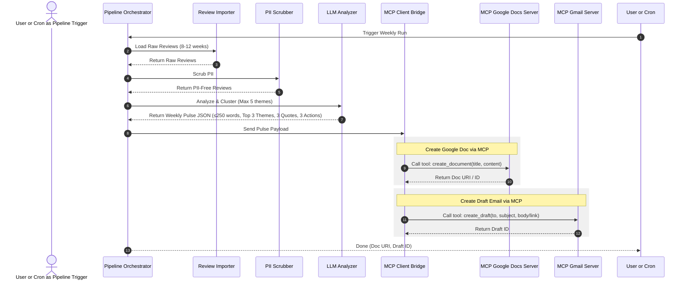

# Project Architecture: Mobile Store Feedback Weekly Pulse

This document outlines the detailed system architecture, component design, data flow, and schemas for the Mobile Store Feedback Weekly Pulse application based on the requirements defined in the [context.md](file:///d:/anita/product-AI-training/Milestone -- AI agent and MCP/context.md).

---

## 🏗️ System Overview

The system operates as an **orchestration pipeline** that ingests raw mobile store review data, processes and clusters it using a Language Model (LLM), and propagates the outputs to external services (Google Docs and Gmail) using the **Model Context Protocol (MCP)**. 

By leveraging MCP, the core application remains agnostic to the underlying Google REST APIs and authentication mechanisms, delegating those interactions to standalone MCP servers.

```mermaid
graph TD
    subgraph Input Layer
        RawReviews[Raw Reviews: JSON/CSV]
    end

    subgraph Core Pipeline
        Importer[Review Importer]
        Scrubber[PII Scrubber]
        LLMEngine[LLM Analyzer / Clusterer]
        Orchestrator[Pipeline Orchestrator]
    end

    subgraph Integration Layer (MCP Client)
        MCPClient[MCP Client Bridge]
    end

    subgraph MCP Servers
        DocsServer[MCP Google Docs Server]
        GmailServer[MCP Gmail Server]
    end

    subgraph External Platforms
        GoogleDocs[Google Docs]
        Gmail[Gmail Drafts]
    end

    %% Data flow connections
    RawReviews --> Importer
    Importer --> Scrubber
    Scrubber -->|PII-Free Reviews| LLMEngine
    LLMEngine -->|Structured Weekly Pulse| Orchestrator
    Orchestrator --> MCPClient
    
    MCPClient <-->|MCP Protocol: JSON-RPC| DocsServer
    MCPClient <-->|MCP Protocol: JSON-RPC| GmailServer
    
    DocsServer <-->|Google APIs / Credentials| GoogleDocs
    GmailServer <-->|Google APIs / Credentials| Gmail
```

---

## 🧩 Component Details

### 1. Review Importer
- **Purpose**: Ingests App Store and Play Store review data covering the last 8–12 weeks.
- **Inputs**: File paths or inputs representing public review exports.
- **Fields Processed**: `rating`, `title`, `text`, `date`, `version`.

### 2. PII Scrubber (Privacy Layer)
- **Purpose**: Enforces the privacy constraint before data is sent to the LLM or saved in downstream documents.
- **Scrubbing Targets**: Usernames, real names, email addresses, device IDs, IP addresses, and other identifiers.
- **Method**: Redacts identifiers (e.g., replacing names with `[Anonymous User]` or stripping them entirely) to ensure compliance with privacy constraints.

### 3. LLM Analyzer & Clusterer
- **Purpose**: Performs semantic clustering and summarization.
- **Tasks**:
  - Groups reviews into a maximum of 5 distinct themes (e.g., *onboarding*, *KYC*, *payments*).
  - Selects the top 3 themes based on frequency and severity.
  - Extracts exactly 3 verbatim user quotes supporting these themes (without inventing wording).
  - Generates exactly 3 concrete, theme-grounded action ideas.
  - Enforces the ≤250 words length constraint for the final note.

### 4. Pipeline Orchestrator
- **Purpose**: Controls the execution order of the import, scrubbing, analysis, and publishing stages.
- **Execution Flow**:
  1. Trigger pipeline execution.
  2. Call Importer to fetch data.
  3. Clean data via PII Scrubber.
  4. Send clean reviews to LLM Analyzer.
  5. Format LLM output into the defined Weekly Pulse document schema.
  6. Send formatted output to MCP Client Bridge.

### 5. MCP Client Bridge
- **Purpose**: Acts as the communication bridge using the Model Context Protocol.
- **Functions**:
  - Connects to the **Google Docs MCP Server** and **Gmail MCP Server**.
  - Discovers available tools on these servers (e.g., `create_document`, `append_text`, `create_draft`).
  - Executes tool calls over JSON-RPC.

---

## 🔄 End-to-End Data Flow



---

## 📊 Data Schemas

### 1. Ingested Review Schema (JSON representation)
```json
{
  "source": "App Store | Play Store",
  "rating": 4,
  "title": "Easy to use but slow KYC",
  "text": "The app interface is really smooth. However, it took three days to verify my identity during onboarding.",
  "date": "2026-07-10T14:32:00Z",
  "version": "2.4.1"
}
```

### 2. Output Weekly Pulse Schema (JSON representation)
```json
{
  "meta": {
    "weekEnding": "2026-07-16",
    "totalReviewsAnalyzed": 142
  },
  "themes": [
    {
      "name": "KYC & Onboarding",
      "sentiment": "Mixed",
      "percentage": 42.0
    },
    {
      "name": "Withdrawal Latency",
      "sentiment": "Negative",
      "percentage": 28.0
    },
    {
      "name": "UI Simplification",
      "sentiment": "Positive",
      "percentage": 15.0
    }
  ],
  "verbatimQuotes": [
    "It took three days to verify my identity during onboarding.",
    "Withdrawals are delayed up to 48 hours without any status update.",
    "Love the new dark mode and overall clean layout."
  ],
  "actionIdeas": [
    "Streamline document upload verification in the onboarding flow to reduce verification latency.",
    "Implement real-time status tracking and push notifications for withdrawal requests.",
    "Promote dark mode setting as a feature highlight in the onboarding tour."
  ]
}
```

---

## 🛡️ Privacy and Safety Mechanisms

1. **Local scrubbing first**: The PII Scrubber runs locally *before* review data is passed to external LLM APIs.
2. **Regex & Entity Extraction (NER)**: Uses Named Entity Recognition or simple regex models to filter phone numbers, emails, and full names from the raw reviews.
3. **Anonymized Quotes**: Verbatim quotes are extracted but stripped of references to names or specific accounts (e.g. "I'm Anita and my account 123..." -> "I'm [User] and my account [ID]...").

---

## ⚠️ Error Handling and Robustness

- **MCP Connection Failures**: If an MCP server is unreachable, the orchestrator caches the Weekly Pulse output locally and retries the connection.
- **Review Parsing Failures**: Malformed reviews are ignored or logged as warnings without halting the overall weekly run.
- **Token Limits / Prompt Length**: If the quantity of reviews is too large for the LLM context window, reviews are pre-summarized or sampled representatively by distribution of ratings and date.
