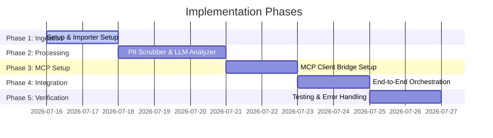

# Implementation Plan: Mobile Store Feedback Weekly Pulse

This document outlines a phase-wise plan to implement the Mobile Store Feedback Weekly Pulse application. The plan maps out the process from initial setup to full integrations using the Model Context Protocol (MCP) as detailed in the [architecture.md](file:///d:/anita/product-AI-training/Milestone -- AI agent and MCP/architecture.md) and [context.md](file:///d:/anita/product-AI-training/Milestone -- AI agent and MCP/context.md).

---

## 📅 Roadmap Overview

---

## 🛠️ Phase-Wise Breakdown

### 🎯 Phase 1: Environment Setup & Data Ingestion
**Objective**: Set up the project repository, define dependencies, and build the review data ingestion module.

- [x] **1.1 Project Initialization**
  - Create the package structure (e.g., in Node.js/TypeScript or Python, depending on the preference).
  - Add configuration files (`package.json` or `pyproject.toml`, `.gitignore`, and environment configuration templates).
- [x] **1.2 Ingestion Engine Development**
  - Implement a `ReviewImporter` module capable of reading public review exports (JSON/CSV).
  - Write test fixtures with sample reviews spanning 8–12 weeks (created [sample_reviews.json](file:///d:/anita/product-AI-training/Milestone -- AI agent and MCP/data/sample_reviews.json) and normalized actual reviews in [normalized_reviews.json](file:///d:/anita/product-AI-training/Milestone -- AI agent and MCP/data/normalized_reviews.json)).
- [x] **1.3 Input Validation & Review Cleaning**
  - Ensure the importer parses review structures (fields: `rating`, `title`, `text`, `date`, `version`).
  - Reject or log entries missing critical fields, having less than 8 words, containing emojis, or written in Hindi (Devanagari script).

---

### 🧠 Phase 2: Core Processing & NLP Pipeline
**Objective**: Build local PII filtering and LLM analysis components to extract themes, quotes, and action ideas.

- [ ] **2.1 PII Scrubber (Privacy Layer)**
  - Implement regex or Named Entity Recognition (NER) utilities to scrub sensitive data (usernames, emails, phone numbers, system-level IDs) from raw review texts.
  - Return PII-free reviews for subsequent analysis.
- [ ] **2.2 LLM Analysis Prompt Engineering & Analyze Strategy**
  - Use [normalized_reviews.json](file:///d:/anita/product-AI-training/Milestone -- AI agent and MCP/data/normalized_reviews.json) as the core input dataset containing both App Store and Play Store reviews.
  - Implement a prompt template instructing the LLM to classify input reviews against **5 predefined domain themes**:
    1. *Account Verification & KYC* (identity verification delays, account blocks, compliance friction)
    2. *Transfer Latency & Speed* (delayed transactions, mismatched timing expectations)
    3. *Fees & Exchange Rates* (currency conversion costs, deposit fees, pricing transparency)
    4. *Customer Support Access* (unreachable human support, auto-responses, unresolved disputes)
    5. *Card Features & Usability* (card freezing options, virtual/disposable card requests, app UI feedback)
  - Configure the prompt instructions for the LLM to:
    - Perform classification and sentiment mapping (Positive, Negative, Mixed) on each review.
    - Select the **top 3 themes** based on volume or severity.
    - Extract exactly **3 verbatim, anonymized user quotes** directly supporting these themes. Ensure no paraphrasing or invented text is generated, and confirm all PII (names, phone numbers, emails, locations) is stripped.
    - Generate exactly **3 concrete action ideas** that address the major complaints identified in the top themes.
    - Output the final scannable note structured in Markdown format conforming to a strict **≤250 words** length limit.
  - Implement a parser/validator module that:
    - Verifies the LLM output conforms to the structured JSON schemas.
    - Validates word count constraints and quote presence in the input source texts to ensure zero hallucinations.
  - **API Rate & Token Limit Throttling (`llama-3.3-70b-versatile` constraints)**:
    - Design a rate-limited queuing system to handle the tight 30 RPM, 1K TPM, 12K RPD, and 100K TPD limits.
    - Process reviews in small batches (e.g., 3–5 reviews per batch).
    - Implement client-side throttling (proportional sleep delays between calls) to ensure combined input/output tokens do not exceed 1,000 in any 60-second window.
    - Apply representative sampling on the 172 normalized reviews to compress the input payload, ensuring we fit within the 100K daily token limit.
- [ ] **2.3 Local Processing Verification**
  - Run the PII scrubber and LLM analyzer locally against the mock and actual datasets in [normalized_reviews.json](file:///d:/anita/product-AI-training/Milestone -- AI agent and MCP/data/normalized_reviews.json) to verify constraints.

---

### 🔌 Phase 3: MCP Client Bridge Setup
**Objective**: Establish the MCP client wrapper that will interface with Google Docs and Gmail MCP servers.

- [ ] **3.1 MCP Client Implementation**
  - Integrate an MCP Client library (e.g., `@modelcontextprotocol/sdk` or Python equivalent).
  - Write utility connectors to connect to running MCP servers over stdio or SSE.
- [ ] **3.2 Connection & Tool Discovery**
  - Connect to the **Google Docs MCP Server** and discover/validate tools (e.g., `create_document`, `append_text`).
  - Connect to the **Gmail MCP Server** and discover/validate tools (e.g., `create_draft`).
- [ ] **3.3 Mock Integration Tests**
  - Create integration tests that verify MCP JSON-RPC requests are formatted correctly.

---

### 🔄 Phase 4: Integration & E2E Orchestration
**Objective**: Connect all modules into a single, automated orchestrator that runs the pipeline and outputs to Google Docs and Gmail.

- [ ] **4.1 Orchestrator Implementation**
  - Build `PipelineOrchestrator` to tie the components together sequentially:
    `Trigger -> Import -> Scrub -> Cluster & Summarize -> Send to MCP Docs Server -> Send to MCP Gmail Server`.
- [ ] **4.2 Google Doc Generation**
  - Format the weekly pulse output into a clean, markdown-like document layout.
  - Send JSON-RPC payload to create or overwrite the Docs document.
- [ ] **4.3 Gmail Draft Creation**
  - Generate the email subject and body.
  - Call the Gmail MCP server to create the email draft containing the link to the created Google Doc.

---

### 🛡️ Phase 5: Verification, Edge Cases & Error Handling
**Objective**: Ensure the system handles failures gracefully, runs within limits, and is production-ready.

- [ ] **5.1 Error Handling & Recovery**
  - Gracefully handle MCP server connection timeouts or offline statuses.
  - Add retry mechanisms for LLM API calls.
  - Add fallback logic if input review token usage exceeds the LLM context window (e.g., summarize reviews in batches).
- [ ] **5.2 Verification and Compliance Auditing**
  - Audit generated Google Docs and Gmail drafts to ensure:
    - **No PII** remains in the output.
    - Word count is **under 250 words**.
    - No more than **3 themes**, **3 quotes**, and **3 action items** are present in the final note.
  - Run the complete end-to-end pipeline with a production-sized mock feed.

---

## 🚦 Phase Verification Criteria

| Phase | Milestone / Outcome | Validation Command / Check |
| :--- | :--- | :--- |
| **Phase 1** | Successful ingestion of raw mobile reviews. | Review importer unit tests pass. |
| **Phase 2** | Redacted, clustered weekly pulse JSON generated locally. | LLM response validation schema check passes. |
| **Phase 3** | Successful handshake and discovery with MCP servers. | MCP discovery check scripts return 0. |
| **Phase 4** | E2E run successfully updates Google Doc & Gmail draft. | Review Google Doc link & check Gmail draft folder. |
| **Phase 5** | System resilience under high volume and connection failures. | Timeout simulation test and word count assertion check. |
